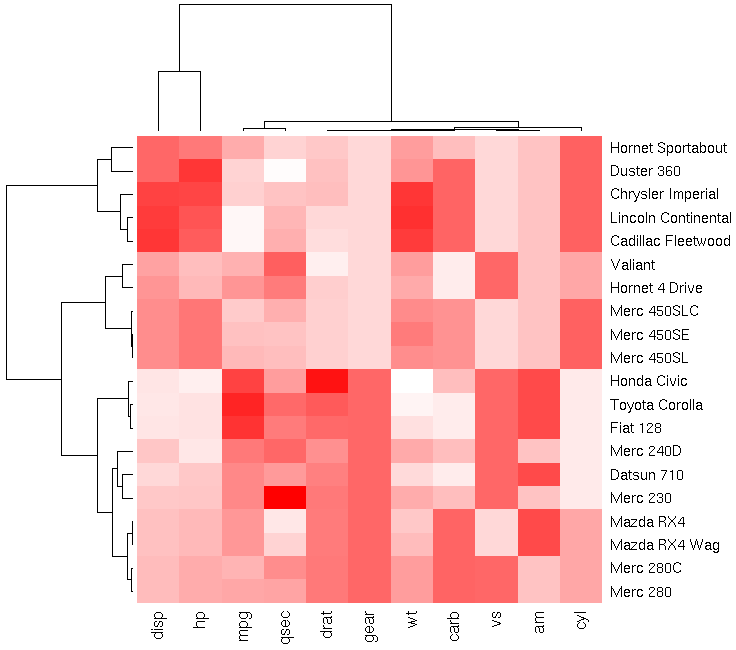

# InCHlib.js

[Official InCHlib webpage](http://openscreen.cz/software/inchlib)

---

## Forked modifications

Added `inchlib_R/` that contains scripts to support converting heatmaps generated in R to InCHlib JSON format.  
`inchlib_R/inchlib_clust.R` contains various helper methods to convert R heatmaps to InCHlib JSON format  
`inchlib_R/example.R` contains an example of going from R heatmaps to InCHlib JSON format, outputs example.json  
`inchlib_R/example.html` visualizes example.json using the InCHlib library  

Heatmap in R:

Heatmap converted for InCHlib

---

**How to cite:** Škuta, C.; Bartůněk, P.; Svozil, D. InCHlib – interactive cluster heatmap for web applications. Journal of Cheminformatics 2014, 6 (44), [DOI: 10.1186/s13321-014-0044-4](http://www.jcheminf.com/content/6/1/44).

InCHlib (Interactive Cluster Heatmap library) is an open source interactive Javascript library which provides an easy way to display and analyze hierarchically clustered data and cluster heatmaps. It implements a raster-based HTML5 canvas visualization using the open source Javascript framework KineticJS. InCHlib is multiplatform and works in all major internet browsers (Internet Explorer, Mozilla Firefox, Google Chrome, Safari, Opera). Its speed is determined by the client’s hardware and internet browser. For smoothest user exeprience, we recommend Google Chrome.
